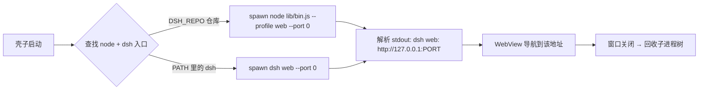

# deepseek-harness-shell

给 [deepseek-harness](https://github.com/deepseek-ai/deepseek-harness)（dsh）套上 WebView 桌面壳，
让 `dsh web` 像原生应用一样快速启动，覆盖 **macOS / Windows / Linux** 三平台。

- 壳：**Wails v3**（`v3.0.0-beta.8`，Go 后端 + 系统 WebView）
- 内核：spawn `dsh --profile web --host 127.0.0.1 --port 0` 子进程，WebView 指向它
- 零端口冲突：`--port 0` 让 OS 分配空闲端口，壳子从 stdout 解析实际地址
- 自动更新：内置 Wails v3 Updater，从 GitHub Releases 检查/下载/校验/替换

## 工作原理



查找优先级（dsh.go）：

| 目标 | 环境变量 / 位置 |
|---|---|
| Node 可执行文件 | `DSH_NODE` → 二进制旁 `runtime/bin/node(.exe)` → `PATH` |
| dsh 入口 | `DSH_LAUNCH`（完整命令）→ `DSH_REPO`/`DSH_HOME` 仓库根 → 二进制旁 `deepseek-harness/` → `PATH` 中的 `dsh` |

仓库入口优先使用**发布产物** `apps/cli/lib/bin.js`（tsdown 打包，规避 tsx 直跑 TS 源码时
`const enum` 不导出 `FiberState` 的兼容问题）；仅当 lib 不存在时才回退 `src/bin.ts`。

## 快速开始（开发机）

前置：Go ≥ 1.24、Node ≥ 22.19、deepseek-harness 仓库已 `pnpm install`。
若仓库 `apps/cli/lib` 缺失或过旧，先执行 `pnpm build:lib` 生成发布产物。

```sh
# 构建当前平台（本机 macOS arm64 已验证）
go build -tags production -o bin/deepseek-harness-shell .

# 运行（DSH_REPO 指向 dsh 仓库根）
DSH_REPO=/path/to/deepseek-harness ./bin/deepseek-harness-shell
```

启动后窗口先显示内置加载页，dsh 就绪后自动跳转到实际监听地址。
dsh 的 stderr 日志写入系统临时目录 `deepseek-harness-dsh.log`（macOS/Linux 为 `$TMPDIR`，Windows 为 `%TEMP%`）。

## 三平台构建

| 平台 | 方式 | 说明 |
|---|---|---|
| macOS arm64 | `task build` | 本机直接构建，已验证 |
| macOS amd64 | macOS Intel 机器或 CI | CGO 依赖 Cocoa，需在 macOS 构建 |
| Windows amd64 | `task build:windows` | **纯 Go 后端，可在 macOS/Linux 上交叉编译**（已验证可编译） |
| Linux amd64 | `task build:linux` | 需 WebKitGTK 6.0，用 Linux 机器或 Docker |

- `wails3 build`（等价 `go build -tags production`）
- 交叉编译 Windows：`task build:windows`（无需 mingw）
- Linux Docker 构建：`task build:linux:docker`（镜像 `wailsapp/wails:v3-beta`）
- 三平台原生构建 CI：`.github/workflows/build.yml`（打 tag `v*` 触发，产出四件制品）

## 自动更新

基于 Wails v3 内置 Updater（`pkg/updater`） + GitHub Releases，零第三方依赖。

- **provider**：GitHub Releases（`lunarroute26/deepseek-harness-shell`）
- **完整性校验**：发布时生成 `SHA256SUMS`，客户端下载后按 sha256 摘要校验
- **信任锚**：`updater.key.pub` 已通过 `go:embed` 编入二进制；私钥 `updater.key` 不入库（见 `.gitignore`），仅用于发布时签名清单
- **检查时机**：启动 5 秒后静默检查一次（有新版才弹窗），之后每 6 小时后台轮询
- **版本号**：由构建 ldflags 注入 `-X main.version=<tag 去 v>`；更新检查要求 `CurrentVersion` 不带 `v`、Release tag 带 `v`

发布流程（CI 自动完成，见 `.github/workflows/build.yml`）：

1. 打 tag `v0.1.0` → 触发四平台构建（macOS arm64/amd64、Windows amd64、Linux amd64）
2. 制品按 updater 命名约定打包：`deepseek-harness-shell-<goos>-<goarch>.zip|.tar.gz`
3. 合并产物生成 `SHA256SUMS`，一并上传到 GitHub Release

注意：v1 更新器只支持**单二进制 / zip / tar.gz** 且压缩包必须**恰好一个顶层条目**；
`.dmg/.msi/.pkg` 不支持。macOS 正式分发需 Developer ID 签名 + 公证（否则 Gatekeeper 拦截替换后的二进制）。

## 打包分发

壳子产物只是一个 Go 可执行文件；运行时还需要 **Node** 和 **dsh 代码**。两种分发策略：

1. **系统 Node 模式（开发/内部）**：要求用户机器已装 Node ≥ 22.19，`DSH_REPO` 指向 dsh 仓库（或 `npm i -g @deepseek-ai/dsh` 后直接用 `dsh` 命令）。
2. **随包内置模式（正式分发）**：目录布局如下，壳子自动探测：

   ```
   dist/
   ├── deepseek-harness-shell(.exe)   # 壳子
   ├── runtime/bin/node(.exe)          # Node 运行时（>= 22.19，官网下载对应平台版）
   └── deepseek-harness/               # dsh 仓库（已 pnpm install + pnpm build:lib；可裁剪测试文件）
   ```

   Windows 额外注意：依赖 WebView2 Runtime（Win10/11 自带，Win7/8 需安装）；可用
   Inno Setup 打成安装包。Linux 可打 AppImage，需目标系统有 WebKitGTK 6.0
   （Debian/Ubuntu：`libwebkitgtk-6.0-4`，Fedora：`webkitgtk6.0`）。

## 环境变量

| 变量 | 作用 |
|---|---|
| `DSH_REPO` / `DSH_HOME` | dsh 仓库根目录（含 `apps/cli/lib/bin.js`） |
| `DSH_NODE` | 指定 Node 可执行文件 |
| `DSH_LAUNCH` | 完全自定义启动命令（空格分隔，支持双引号路径） |

## 已知限制

- **Wails v3 仍是 beta**（v3.0.0-beta.8，2026-08-12 发布）：API 已稳定但官方未宣称生产就绪；v2 是当前稳定版。本项目锁定 beta.8，升级需核对 API（如窗口创建、导航、日志接口均以 beta.8 实测为准）。
- 壳子不打包 Node 运行时，正式分发需按上文"随包内置模式"处理。
- 壳子进程被 SIGKILL 强杀时无法回收 dsh 子进程；正常关闭窗口会走清理路径。
- dsh 首次启动需加载 Cordis 插件树，就绪等待上限 90 秒；日志见临时目录。
- 更新只替换壳子二进制，不覆盖 dsh 后端（dsh 依赖 Node 与仓库，见"打包分发"）。

## 目录结构

```
.
├── main.go            # Wails v3 入口：窗口 + 就绪导航 + updater 初始化 + 退出回收
├── dsh.go             # 子进程管理：命令构造、端口解析、日志
├── proc_unix.go       # Unix 进程组回收（SIGTERM → SIGKILL）
├── proc_windows.go    # Windows 进程树回收（taskkill /T /F）
├── updater.key.pub    # 更新签名公钥（go:embed 编入二进制；私钥 updater.key 不入库）
├── frontend/dist/     # 内嵌启动页（加载中 / 错误提示）
├── Taskfile.yml       # 构建任务封装
└── .github/workflows/build.yml  # 三平台构建 + Release 发布流水线
```
