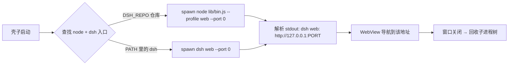

# deepseek-harness-shell

给 [deepseek-harness](https://github.com/deepseek-ai/deepseek-harness)（dsh）套上 WebView 桌面壳，
让 `dsh web` 像原生应用一样快速启动，覆盖 **macOS / Windows / Linux** 三平台。

- 壳：**Wails v3**（`v3.0.0-beta.8`，Go 后端 + 系统 WebView）
- 内核：spawn `dsh --profile web --host 127.0.0.1 --port 0` 子进程，WebView 指向它
- 零端口冲突：`--port 0` 让 OS 分配空闲端口，壳子从 stdout 解析实际地址
- 自动更新：内置 Wails v3 Updater，从 GitHub Releases 检查/下载/校验/替换

## 工作原理



查找优先级（dsh.go）：

| 目标 | 环境变量 / 位置 |
|---|---|
| Node 可执行文件 | `DSH_NODE` → 安装资源中的 `payload/runtime/bin/node(.exe)` → `PATH` |
| dsh 入口 | `DSH_LAUNCH` → `DSH_REPO`/`DSH_HOME` → 安装资源中的 `payload/dsh/lib/bin.js` → `PATH` 中的 `dsh` |

仓库入口优先使用**发布产物** `apps/cli/lib/bin.js`（tsdown 打包，规避 tsx 直跑 TS 源码时
`const enum` 不导出 `FiberState` 的兼容问题）；仅当 lib 不存在时才回退 `src/bin.ts`。

## 快速开始（开发机）

前置：Go ≥ 1.24、Node ≥ 22.19、deepseek-harness 仓库已 `pnpm install`。
若仓库 `apps/cli/lib` 缺失或过旧，先执行 `pnpm build:lib` 生成发布产物。

```sh
# 构建当前平台（本机 macOS arm64 已验证）
go build -tags production -o bin/deepseek-harness-shell .

# 运行（DSH_REPO 指向 dsh 仓库根）
DSH_REPO=/path/to/deepseek-harness ./bin/deepseek-harness-shell
```

启动后窗口先显示内置加载页，dsh 就绪后自动跳转到实际监听地址。
dsh 的 stderr 日志写入系统临时目录 `deepseek-harness-dsh.log`（macOS/Linux 为 `$TMPDIR`，Windows 为 `%TEMP%`）。

## 三平台打包

| 平台 | 方式 | 说明 |
|---|---|---|
| macOS | `wails3 task darwin:package:dmg ARCH=arm64` | `.app` 和 `.dmg`，payload 位于 `Contents/Resources` |
| Windows | `wails3 task windows:create:nsis:installer ARCH=amd64` | NSIS 安装器，payload 安装到 exe 旁 |
| Linux | `wails3 task linux:package ARCH=amd64` | AppImage、deb、rpm、Arch 包 |

正式打包前，先构建 deepseek-harness，再生成目标平台 payload：

```sh
wails3 task stage:payload \
  TARGET_OS=darwin ARCH=arm64 \
  DSH_REPO=/path/to/deepseek-harness \
  DSH_NODE=/path/to/target/node

wails3 task verify:payload TARGET_OS=darwin ARCH=arm64
```

`DSH_NODE` 必须是目标平台/架构的 Node 可执行文件。staging 使用仓库 lockfile 的
现代 `pnpm deploy --prod`，不再重新解析依赖。打包任务会再次校验
`payload.json`、Node 的 PE/ELF/Mach-O 目标、dsh 入口和所有符号链接，并拒绝 `node-pty` 中不属于目标
平台/架构的预编译目录。Windows 使用无 junction 的 hoisted 依赖树，避免 NSIS
递归跟随 pnpm 依赖环；闭包不完整、残留链接或混入异平台原生文件时直接失败。

CI 还会静默安装 Windows NSIS、解包 Linux AppImage，并从安装后的 payload 使用
包内 Node 启动 dsh Web 服务、请求一次本地页面。安装包能生成但本地服务无法就绪时，
构建会直接失败，不会上传制品。

## 自动更新

基于 Wails v3 内置 Updater（`pkg/updater`） + GitHub Releases，零第三方依赖。

- **provider**：GitHub Releases（`lunarroute26/deepseek-harness-shell`）
- **完整性校验**：发布时生成 `SHA256SUMS`，客户端下载后按 sha256 摘要校验
- **信任锚**：`updater.key.pub` 已通过 `go:embed` 编入二进制；私钥 `updater.key` 不入库（见 `.gitignore`），仅用于发布时签名清单
- **检查时机**：macOS 启动 5 秒后静默检查一次，之后每 6 小时后台轮询
- **版本号**：由构建 ldflags 注入 `-X main.version=<tag 去 v>`；更新检查要求 `CurrentVersion` 不带 `v`、Release tag 带 `v`

发布流程（CI 自动完成，见 `.github/workflows/build.yml`）：

1. 打 tag `v0.1.0` → 触发四个原生构建任务（macOS arm64/amd64、Windows amd64、Linux amd64）
2. macOS 发布完整 `.app` zip 更新包；Windows/Linux 发布包含 payload 的完整安装产物
3. 合并产物生成 `SHA256SUMS`，一并上传到 GitHub Release

Wails updater 在 macOS 可原子替换整个 `.app`，因此能连同 payload 更新。Windows/Linux
当前只能原子替换单个 exe，无法同步 sidecar 目录，所以应用内更新在这两个平台禁用，必须使用
新安装器升级。macOS 正式分发仍需 Developer ID 签名和公证。

## 打包分发

开发时可使用系统 Node 和源码仓库；正式安装包必须携带闭合的 **Node + dsh payload**：

1. **系统 Node 模式（开发/内部）**：要求用户机器已装 Node ≥ 22.19，`DSH_REPO` 指向 dsh 仓库（或 `npm i -g @deepseek-ai/dsh` 后直接用 `dsh` 命令）。
2. **随包内置模式（正式分发）**：Windows/Linux 的目录布局如下；macOS 把同一
   `payload` 目录放在 `.app/Contents/Resources`：

   ```
   dist/
   ├── deepseek-harness-shell(.exe)   # 壳子
   └── payload/
       ├── payload.json                # 平台、架构、Node/dsh 版本与 dsh commit
       ├── runtime/bin/node(.exe)       # 目标平台 Node 运行时
       └── dsh/                         # pnpm deploy 生产依赖闭包
   ```

   Windows NSIS 安装器同时处理 WebView2 Runtime。Linux 包声明 WebKitGTK 6.0 运行依赖。

## 环境变量

| 变量 | 作用 |
|---|---|
| `DSH_REPO` / `DSH_HOME` | dsh 仓库根目录（含 `apps/cli/lib/bin.js`） |
| `DSH_NODE` | 指定 Node 可执行文件 |
| `DSH_LAUNCH` | 完全自定义启动命令（空格分隔，支持双引号路径） |

## 已知限制

- **Wails v3 仍是 beta**（v3.0.0-beta.8，2026-08-12 发布）：API 已稳定但官方未宣称生产就绪；v2 是当前稳定版。本项目锁定 beta.8，升级需核对 API（如窗口创建、导航、日志接口均以 beta.8 实测为准）。
- 壳子进程被 SIGKILL 强杀时无法回收 dsh 子进程；正常关闭窗口会走清理路径。
- dsh 首次启动需加载 Cordis 插件树，就绪等待上限 90 秒；日志见临时目录。
- Windows/Linux 应用内更新暂时禁用，升级必须使用包含完整 payload 的新安装器。

## 目录结构

```
.
├── main.go            # Wails v3 入口：窗口 + 就绪导航 + updater 初始化 + 退出回收
├── dsh.go             # 子进程管理：命令构造、端口解析、日志
├── lifecycle.go       # splash 握手、状态重放、串行重试与关闭
├── proc_unix.go       # Unix 进程组回收（SIGTERM → SIGKILL）
├── proc_windows.go    # Windows 进程树回收（taskkill /T /F）
├── scripts/           # payload staging、闭包验证与 AppImage 重打包
├── updater.key.pub    # 更新签名公钥（go:embed 编入二进制；私钥 updater.key 不入库）
├── frontend/dist/     # 内嵌启动页（加载中 / 错误提示）
├── Taskfile.yml       # 构建任务封装
└── .github/workflows/build.yml  # 三平台构建 + Release 发布流水线
```
