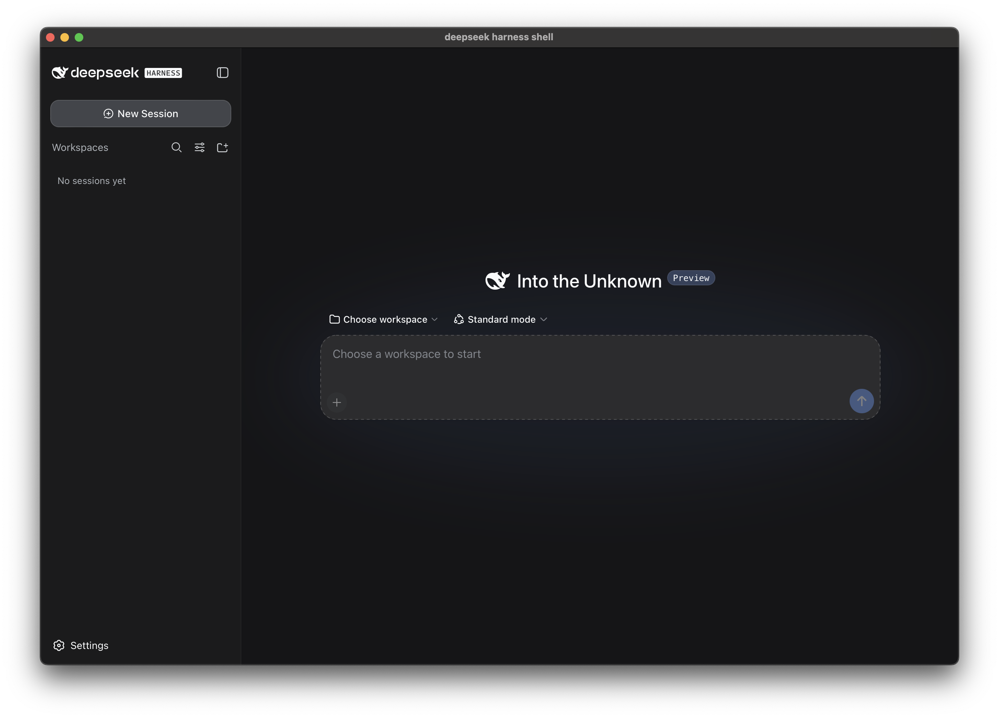
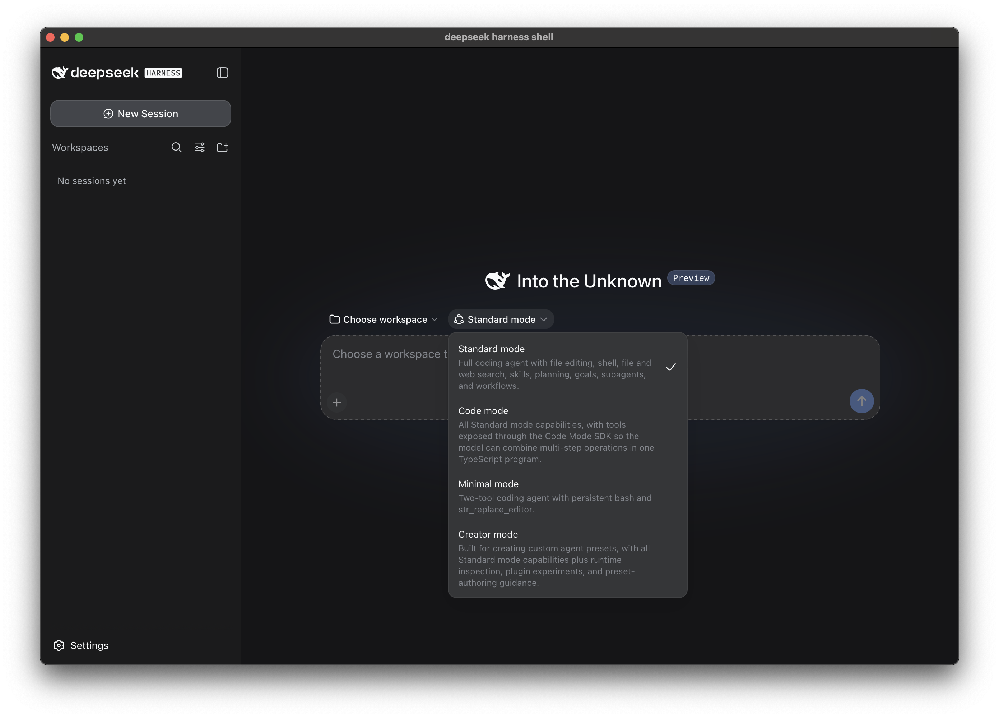
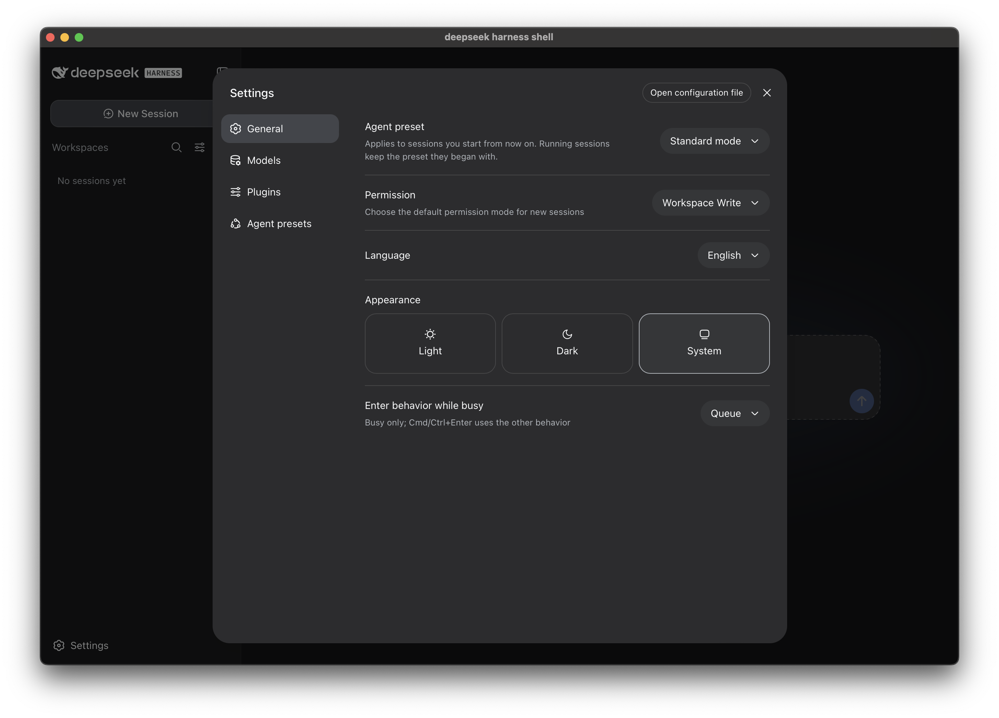
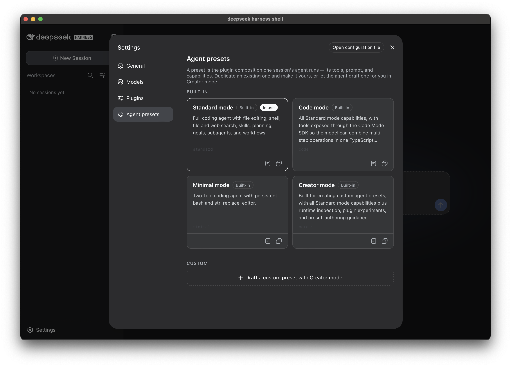
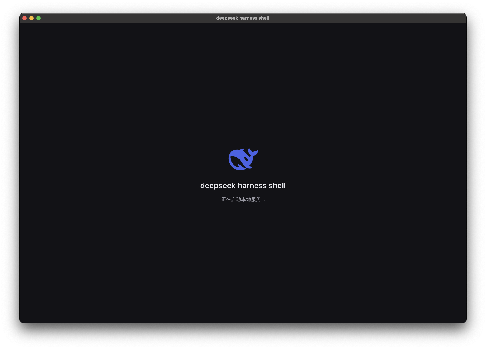
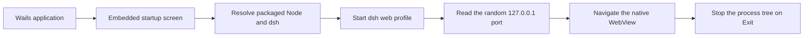

<p align="right"><a href="./README_ZH.md">简体中文</a></p>

<p align="center">
  
</p>

<h1 align="center">deepseek harness shell</h1>

<p align="center">
  A third-party, cross-platform desktop shell for
  <a href="https://github.com/deepseek-ai/deepseek-harness">DeepSeek Harness</a>.
</p>

<p align="center">
  <a href="https://github.com/lunarroute26/deepseek-harness-shell/releases/latest"></a>
  <a href="./LICENSE"></a>
  
  
</p>

<p align="center">
  <a href="https://github.com/lunarroute26/deepseek-harness-shell/releases/latest"><strong>Download</strong></a>
  &nbsp;·&nbsp;
  <a href="#screenshots">Screenshots</a>
  &nbsp;·&nbsp;
  <a href="#development">Build from source</a>
</p>



## What is deepseek harness shell?

`deepseek harness shell` packages the DeepSeek Harness web experience as a native desktop application built with Wails v3 and the operating system WebView. It launches a local `dsh` web service on an ephemeral loopback port, waits until it is ready, and then navigates the desktop window to it.

Release packages are self-contained: each one carries the Node.js runtime and production `dsh` dependency closure for that exact operating system and architecture. End users do not need to install Node.js or download the DeepSeek Harness source repository.

This repository is an independent shell provider. It does not modify or vendor the DeepSeek Harness product interface; that interface continues to be served by the local DeepSeek Harness process.

## Highlights

- **Native desktop lifecycle.** Uses the system WebView, native title bar, single-instance handling, and a system tray.
- **Self-contained releases.** Bundles only the target platform's Node.js runtime and production dependencies.
- **No fixed service port.** Starts `dsh` with `--host 127.0.0.1 --port 0`, avoiding collisions with other local applications.
- **Predictable close behavior.** Closing the main window hides it; the tray reopens it, and only **Exit** stops the application and its `dsh` process tree.
- **Native session export.** The shell handles session ZIP exports with a native save dialog and atomic `.part` file replacement, without opening a browser tab or a second task window.
- **Platform-isolated payloads.** macOS, Windows, and Linux packages never carry native runtime files for another platform or architecture.
- **Package-level CI checks.** CI installs the Windows NSIS package, extracts the Linux AppImage, verifies payload formats, launches the bundled service, and performs a real HTTP request before publishing artifacts.
- **macOS updates.** Startup, scheduled, and manual update checks select the matching architecture and replace the complete `.app` bundle.

## Install

Download the package for your system from [GitHub Releases](https://github.com/lunarroute26/deepseek-harness-shell/releases/latest).

| Platform | Architecture | Release asset | Notes |
| --- | --- | --- | --- |
| macOS | Apple Silicon (`arm64`) | `deepseek-harness-shell-darwin-arm64-installer.dmg` | macOS 12 or later |
| macOS | Intel (`amd64`) | `deepseek-harness-shell-darwin-amd64-installer.dmg` | macOS 12 or later |
| Windows | x64 (`amd64`) | `deepseek-harness-shell-windows-amd64-installer.exe` | NSIS installer with WebView2 bootstrapper |
| Linux | x64 (`amd64`) | `deepseek-harness-shell-linux-amd64.AppImage` | Portable AppImage |
| Linux | x64 (`amd64`) | `deepseek-harness-shell-linux-amd64.deb` | GTK4 and WebKitGTK 6.0 runtime required |

Every release also includes `SHA256SUMS`:

```sh
sha256sum -c SHA256SUMS
```

> [!IMPORTANT]
> Current macOS CI builds use ad-hoc signing and are not notarized. Windows builds do not yet use an Authenticode release certificate. Gatekeeper or SmartScreen may therefore show a publisher warning.

## Quick start

1. Install the package for your operating system and architecture.
2. Launch `deepseek harness shell`.
3. Wait for the bundled local service to become ready.
4. Choose a workspace and start a session in the DeepSeek Harness interface.

No external Node.js installation is required for a packaged release.

## Screenshots

The interface below is provided by DeepSeek Harness and hosted inside the native shell.

<table>
  <tr>
    <td width="50%"><br /><sub>New session and workspace selection</sub></td>
    <td width="50%"><br /><sub>Agent preset selector</sub></td>
  </tr>
  <tr>
    <td width="50%"><br /><sub>General settings</sub></td>
    <td width="50%"><br /><sub>Built-in and custom agent presets</sub></td>
  </tr>
  <tr>
    <td colspan="2"><br /><sub>Bundled local service startup</sub></td>
  </tr>
</table>

## How it works



The packaged command is equivalent to:

```text
node <dsh-entry> --profile web --host 127.0.0.1 --port 0
```

The embedded `frontend/dist` directory contains only startup and error states. The actual product interface is served by the local `dsh` process. The shell allows only the active loopback origin when it intercepts session export requests.

The production payload has this shape:

```text
payload/
├── payload.json
├── runtime/
│   └── bin/node(.exe)
└── dsh/
    ├── package.json
    ├── pnpm-lock.yaml
    ├── lib/bin.js
    └── node_modules/
```

The `node_modules` directory is the production closure generated by `pnpm deploy --prod --frozen-lockfile`, not the complete development dependency tree. Staging removes `node-pty` binaries for unrelated systems and verifies that the bundled Node executable is a PE, ELF, or Mach-O file for the requested target.

## Updates

In-app updates are currently enabled only on macOS because the updater can atomically replace the complete `.app`, including its payload.

- A silent startup check runs after launch.
- Scheduled checks run every six hours.
- **Check for Updates...** is available from the application menu.
- Version checks use a 120-second timeout; stalled update downloads may remain idle for up to three hours before failing.
- The updater selects the matching `.app.zip`, not the first-install DMG.

Windows and Linux users install a newer full package because their payload is stored beside the executable and cannot be replaced safely as a single file.

## Development

### Prerequisites

- Go 1.25 or later (CI uses Go 1.26)
- Node.js 24
- pnpm 10
- Wails CLI `v3.0.0-beta.8`
- A built checkout of [deepseek-harness](https://github.com/deepseek-ai/deepseek-harness)

Install the pinned Wails CLI:

```sh
go install github.com/wailsapp/wails/v3/cmd/wails3@v3.0.0-beta.8
```

Build the adjacent or explicitly selected DeepSeek Harness checkout:

```sh
cd /path/to/deepseek-harness
pnpm install --frozen-lockfile
pnpm run build
```

Run the shell with an explicit frontend port. Pick another free port when developing multiple Wails applications:

```sh
cd /path/to/deepseek-harness-shell
DSH_REPO=/path/to/deepseek-harness \
  wails3 dev -config ./build/config.yml -port 9252
```

The shell prefers `apps/cli/lib/bin.js` in repository mode and falls back to the TypeScript source entry only when necessary.

### Runtime resolution

The `dsh` launch source is resolved in this order:

1. Full command in `DSH_LAUNCH`.
2. Repository selected by `DSH_REPO`.
3. Installed production payload.
4. A `deepseek-harness` directory beside the executable.
5. A neighboring repository near the current directory.
6. A global `dsh` command from `PATH`.

Node.js is resolved from `DSH_NODE`, then the packaged runtime, then `PATH`.

### Build a production payload

Prepare each operating system and architecture separately. `DSH_NODE` must point to a Node executable for the target platform:

```sh
wails3 task stage:payload \
  TARGET_OS=darwin \
  ARCH=arm64 \
  DSH_REPO=/path/to/deepseek-harness \
  DSH_NODE=/path/to/target/node

wails3 task verify:payload TARGET_OS=darwin ARCH=arm64
node scripts/smoke-payload.mjs \
  --root build/payload/darwin-arm64 \
  --server
```

### Package

| Target | Command | Output |
| --- | --- | --- |
| macOS | `wails3 task darwin:package:dmg ARCH=arm64` | `.app`, `.dmg` |
| Windows | `wails3 task windows:create:nsis:installer ARCH=amd64` | NSIS installer |
| Linux AppImage | `wails3 task linux:create:appimage ARCH=amd64` | `.AppImage` |
| Linux DEB | `wails3 task linux:create:deb ARCH=amd64` | `.deb` |

### Verify

```sh
go test ./...
go vet ./...
node --test scripts/*.test.mjs
node scripts/verify-packaging.mjs
```

## Configuration

| Variable | Purpose |
| --- | --- |
| `DSH_REPO` | DeepSeek Harness repository root used in development |
| `DSH_HOME` | DeepSeek Harness data directory; defaults to `~/.dsh` |
| `DSH_NODE` | Explicit Node.js executable |
| `DSH_LAUNCH` | Full custom launch command; highest priority |

## Troubleshooting

`dsh` standard output and error are written to:

- macOS / Linux: `$TMPDIR/deepseek-harness-dsh.log`
- Windows: `%TEMP%\deepseek-harness-dsh.log`

Shell logs are written to:

- macOS: `~/Library/Application Support/deepseek harness shell/deepseek-harness.log`
- Windows: `%AppData%\deepseek harness shell\deepseek-harness.log`
- Linux: `~/.config/deepseek harness shell/deepseek-harness.log`

If startup remains on **Starting local service...**:

1. Read `deepseek-harness-dsh.log` for the actual launch command and service error.
2. In a release package, verify `payload.json` and the target Node executable. In development, verify `DSH_REPO`.
3. Ensure the selected DeepSeek Harness checkout has completed `pnpm install --frozen-lockfile` and `pnpm run build`.
4. Check whether endpoint protection blocked the bundled Node.js or child process.
5. The shell reports startup failure after 90 seconds and includes the relevant log path.

## Repository layout

```text
.
├── main.go                  # Wails app, main window, menu, tray and updater
├── dsh.go                   # dsh resolution, launch and readiness detection
├── download.go              # Native session export download
├── lifecycle.go             # Startup, retry and shutdown coordination
├── frontend/dist/           # Embedded startup and error UI
├── docs/screenshots/        # Product screenshots used by both READMEs
├── scripts/                 # Payload staging, verification and smoke tests
├── build/                   # Wails and platform packaging configuration
├── Taskfile.yml             # Task entry points and application version
└── .github/workflows/       # Native multi-platform build and release CI
```

## Known limitations

- The project is pinned to Wails `v3.0.0-beta.8`; upgrades require window, tray, updater, and packaging regression tests.
- macOS 12 is the current minimum supported version.
- Windows and Linux do not yet support in-app updates.
- CI does not currently notarize macOS releases or Authenticode-sign Windows releases.
- A forced process termination cannot guarantee child-process cleanup; a normal tray exit does.

## License and attribution

This shell is released under the [MIT License](./LICENSE).

[DeepSeek Harness](https://github.com/deepseek-ai/deepseek-harness) and its dependencies remain subject to their own licenses and trademarks. This repository provides an independent third-party desktop shell and is not the upstream product repository.
