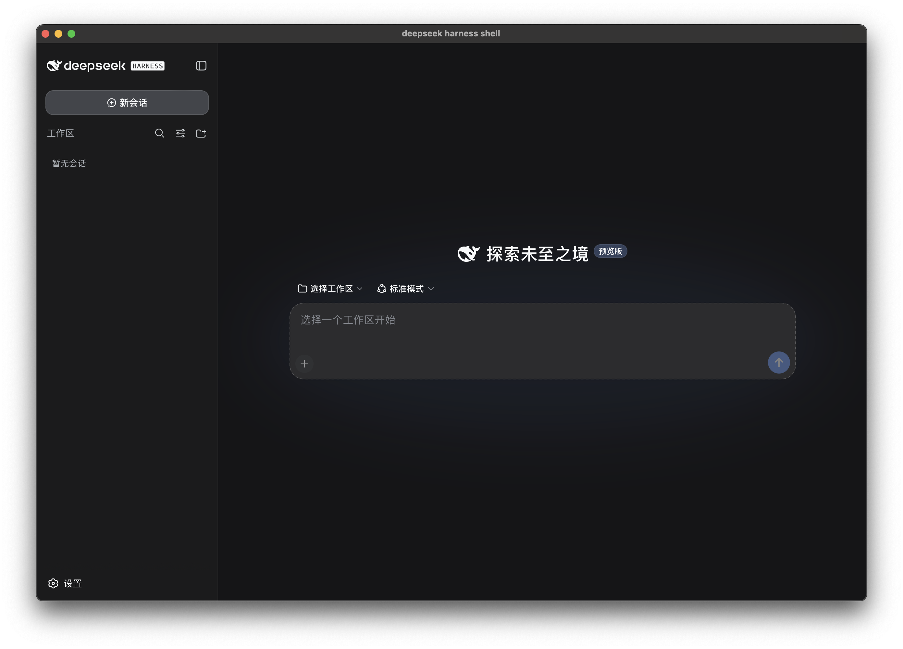
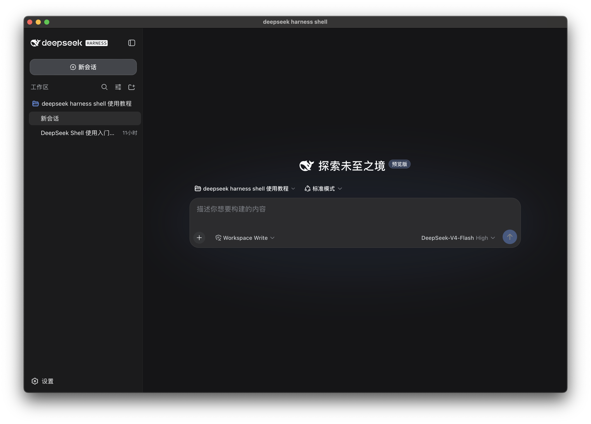
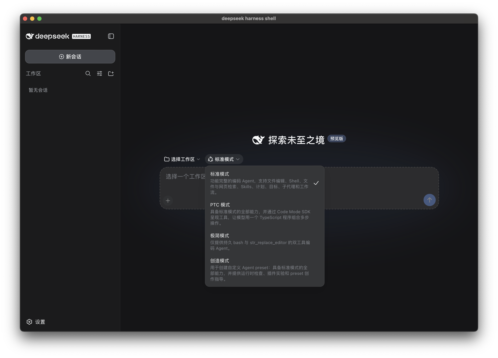
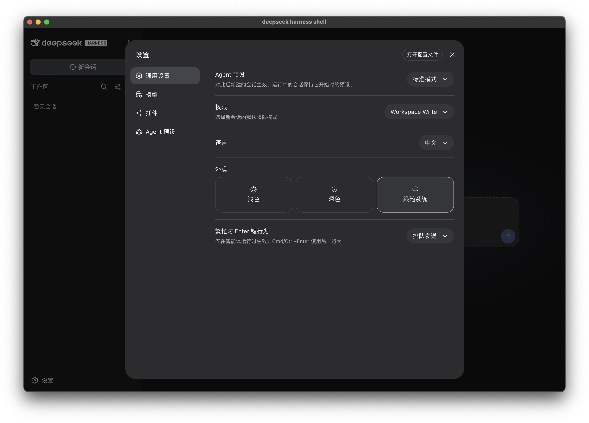

<p align="right"><a href="./README.md">English</a></p>

<p align="center">
  
</p>

<h1 align="center">deepseek harness shell</h1>

<p align="center">
  面向 <a href="https://github.com/deepseek-ai/deepseek-harness">DeepSeek Harness</a> 的第三方跨平台桌面壳。
</p>

<p align="center">
  <a href="https://github.com/lunarroute26/deepseek-harness-shell/releases/latest"></a>
  <a href="./LICENSE"></a>
  
  
</p>

<p align="center">
  <a href="https://github.com/lunarroute26/deepseek-harness-shell/releases/latest"><strong>下载安装</strong></a>
  &nbsp;·&nbsp;
  <a href="#界面截图">界面截图</a>
  &nbsp;·&nbsp;
  <a href="#开发环境">源码构建</a>
</p>



## 项目介绍

`deepseek harness shell` 使用 Wails v3 和系统 WebView，将 DeepSeek Harness 的 Web 体验封装成原生桌面应用。应用会在本机随机回环端口启动 `dsh` Web 服务，等待服务就绪后，再将桌面窗口导航到该服务。

正式发布包已经包含当前操作系统和架构对应的 Node.js 运行时，以及 `dsh` 的生产依赖闭包。最终用户不需要额外安装 Node.js，也不需要下载 DeepSeek Harness 源码仓库。

本项目是独立的第三方壳提供者，不修改或复制 DeepSeek Harness 的产品界面；实际界面仍由本机运行的 DeepSeek Harness 服务提供。

## 主要特性

- **原生桌面生命周期。** 使用系统 WebView、原生标题栏、单实例控制和系统托盘。
- **开箱即用的安装包。** 每个包只携带目标平台的 Node.js 和生产依赖。
- **不占用固定服务端口。** 通过 `--host 127.0.0.1 --port 0` 启动，避免与其他本地应用冲突。
- **符合桌面习惯的关闭逻辑。** 关闭主窗口只会隐藏；托盘可以重新唤起，只有托盘中的“退出”才会关闭应用并回收 `dsh` 进程树。
- **原生 Session 导出。** 使用系统保存对话框下载 ZIP，通过 `.part` 临时文件原子落盘，不打开浏览器页面，也不再显示额外的下载任务窗口。
- **平台 payload 完全隔离。** macOS、Windows、Linux 安装包不会混入其他平台或架构的原生运行文件。
- **安装包级 CI 验证。** CI 会静默安装 Windows NSIS、解包 Linux AppImage、验证 payload、启动包内服务并发起真实 HTTP 请求。
- **macOS 应用内更新。** 支持启动检查、定时检查和菜单手动检查，并只选择当前架构的完整 `.app` 更新包。

## 安装

从 [GitHub Releases](https://github.com/lunarroute26/deepseek-harness-shell/releases/latest) 下载与系统匹配的安装包。

| 平台 | 架构 | Release 文件 | 说明 |
| --- | --- | --- | --- |
| macOS | Apple Silicon (`arm64`) | `deepseek-harness-shell-darwin-arm64-installer.dmg` | 要求 macOS 12 或更高版本 |
| macOS | Intel (`amd64`) | `deepseek-harness-shell-darwin-amd64-installer.dmg` | 要求 macOS 12 或更高版本 |
| Windows | x64 (`amd64`) | `deepseek-harness-shell-windows-amd64-installer.exe` | NSIS 安装器，包含 WebView2 bootstrapper |
| Linux | x64 (`amd64`) | `deepseek-harness-shell-linux-amd64.AppImage` | 便携 AppImage |
| Linux | x64 (`amd64`) | `deepseek-harness-shell-linux-amd64.deb` | 需要 GTK4 和 WebKitGTK 6.0 运行库 |

每个 Release 同时提供 `SHA256SUMS`：

```sh
sha256sum -c SHA256SUMS
```

> [!IMPORTANT]
> 当前 macOS CI 使用 ad-hoc 签名，尚未进行 Apple 公证；Windows 也没有配置 Authenticode 发行证书。Gatekeeper 或 SmartScreen 因此可能显示来源或发布者警告。

## 快速开始

1. 安装与当前操作系统、架构匹配的发布包。
2. 启动 `deepseek harness shell`。
3. 等待包内本地服务就绪。
4. 在 DeepSeek Harness 界面选择工作区并创建会话。

使用正式安装包时不需要单独安装 Node.js。

## 界面截图

以下产品界面由 DeepSeek Harness 提供，并运行在本项目的原生桌面窗口中。

<table>
  <tr>
    <td width="50%"><br /><sub>新建会话与工作区选择</sub></td>
    <td width="50%"><br /><sub>工作区与会话列表</sub></td>
  </tr>
  <tr>
    <td width="50%"><br /><sub>Agent 预设选择</sub></td>
    <td width="50%"><br /><sub>通用设置</sub></td>
  </tr>
  <tr>
    <td colspan="2"><br /><sub>会话模式选择</sub></td>
  </tr>
</table>

## 工作原理


包内启动命令等价于：

```text
node <dsh-entry> --profile web --host 127.0.0.1 --port 0
```

`frontend/dist` 只包含启动和错误状态页，真正的产品界面由本机 `dsh` 服务提供。Shell 在接管 Session 导出请求时，只接受当前动态回环地址的合法请求。

正式 payload 的结构如下：

```text
payload/
├── payload.json
├── runtime/
│   └── bin/node(.exe)
└── dsh/
    ├── package.json
    ├── pnpm-lock.yaml
    ├── lib/bin.js
    └── node_modules/
```

这里的 `node_modules` 是由 `pnpm deploy --prod --frozen-lockfile` 生成的生产依赖闭包，不是开发仓库的完整依赖。Staging 还会删除无关系统的 `node-pty` 原生文件，并验证 Node 可执行文件是否为目标平台对应的 PE、ELF 或 Mach-O 格式。

## 应用更新

应用内更新目前只在 macOS 启用，因为更新器可以原子替换包含 payload 的完整 `.app`。

- 应用启动后会进行一次静默检查。
- 每 6 小时进行一次定时检查。
- 可从应用菜单选择 **Check for Updates...** 手动检查。
- 版本检查超时为 120 秒；更新下载连续空闲 3 小时后才会判定超时。
- 更新器只选择匹配当前架构的 `.app.zip`，不会把首次安装使用的 DMG 当作更新包。

Windows 和 Linux 的 payload 位于可执行文件旁，暂时不能作为单文件安全替换，需要安装新版完整安装包。

## 开发环境

### 前置依赖

- Go 1.25 或更高版本（CI 使用 Go 1.26）
- Node.js 24
- pnpm 10
- Wails CLI `v3.0.0-beta.8`
- 一份已经构建的 [deepseek-harness](https://github.com/deepseek-ai/deepseek-harness) 工作区

安装锁定版本的 Wails CLI：

```sh
go install github.com/wailsapp/wails/v3/cmd/wails3@v3.0.0-beta.8
```

构建相邻或显式指定的 DeepSeek Harness 工作区：

```sh
cd /path/to/deepseek-harness
pnpm install --frozen-lockfile
pnpm run build
```

使用明确的前端端口启动桌面壳；同时开发多个 Wails 应用时，为每个应用选择不同的空闲端口：

```sh
cd /path/to/deepseek-harness-shell
DSH_REPO=/path/to/deepseek-harness \
  wails3 dev -config ./build/config.yml -port 9252
```

仓库模式优先使用 `apps/cli/lib/bin.js`，必要时才回退到 TypeScript 源码入口。

### 运行入口查找顺序

`dsh` 按以下顺序查找：

1. `DSH_LAUNCH` 指定的完整命令。
2. `DSH_REPO` 指定的工作区。
3. 正式安装包中的 production payload。
4. 可执行文件旁的 `deepseek-harness` 目录。
5. 当前目录附近的相邻工作区。
6. `PATH` 中的全局 `dsh` 命令。

Node.js 按 `DSH_NODE`、包内运行时、`PATH` 的顺序查找。

### 构建 production payload

每个目标系统和架构都必须单独准备，`DSH_NODE` 必须指向目标平台的 Node 可执行文件：

```sh
wails3 task stage:payload \
  TARGET_OS=darwin \
  ARCH=arm64 \
  DSH_REPO=/path/to/deepseek-harness \
  DSH_NODE=/path/to/target/node

wails3 task verify:payload TARGET_OS=darwin ARCH=arm64
node scripts/smoke-payload.mjs \
  --root build/payload/darwin-arm64 \
  --server
```

### 平台打包

| 目标 | 命令 | 输出 |
| --- | --- | --- |
| macOS | `wails3 task darwin:package:dmg ARCH=arm64` | `.app`、`.dmg` |
| Windows | `wails3 task windows:create:nsis:installer ARCH=amd64` | NSIS installer |
| Linux AppImage | `wails3 task linux:create:appimage ARCH=amd64` | `.AppImage` |
| Linux DEB | `wails3 task linux:create:deb ARCH=amd64` | `.deb` |

### 验证

```sh
go test ./...
go vet ./...
node --test scripts/*.test.mjs
node scripts/verify-packaging.mjs
```

## 环境变量

| 变量 | 用途 |
| --- | --- |
| `DSH_REPO` | 开发时指定 DeepSeek Harness 工作区根目录 |
| `DSH_HOME` | 指定 DeepSeek Harness 数据目录，默认是 `~/.dsh` |
| `DSH_NODE` | 显式指定 Node.js 可执行文件 |
| `DSH_LAUNCH` | 使用自定义完整启动命令，优先级最高 |

## 日志与排错

`dsh` 标准输出和错误日志：

- macOS / Linux：`$TMPDIR/deepseek-harness-dsh.log`
- Windows：`%TEMP%\deepseek-harness-dsh.log`

桌面壳日志：

- macOS：`~/Library/Application Support/deepseek harness shell/deepseek-harness.log`
- Windows：`%AppData%\deepseek harness shell\deepseek-harness.log`
- Linux：`~/.config/deepseek harness shell/deepseek-harness.log`

如果应用一直停留在 **正在启动本地服务…**：

1. 查看 `deepseek-harness-dsh.log` 中的实际启动命令和服务错误。
2. 正式安装包检查 `payload.json` 与目标平台 Node；开发模式检查 `DSH_REPO`。
3. 确认所选 DeepSeek Harness 工作区已经执行 `pnpm install --frozen-lockfile` 和 `pnpm run build`。
4. 检查安全软件是否阻止包内 Node.js 或子进程启动。
5. 启动超过 90 秒会被判定失败，错误页会显示对应日志路径。

## 仓库结构

```text
.
├── main.go                  # Wails 应用、主窗口、菜单、托盘和更新器
├── dsh.go                   # dsh 查找、启动和就绪检测
├── download.go              # 原生 Session 导出下载
├── lifecycle.go             # 启动、重试和关闭流程
├── frontend/dist/           # 内嵌启动与错误界面
├── docs/screenshots/        # 中英文 README 使用的产品截图
├── scripts/                 # payload staging、验证和冒烟测试
├── build/                   # Wails 与三平台打包配置
├── Taskfile.yml             # 任务入口与应用版本
└── .github/workflows/       # 三平台原生构建与 Release CI
```

## 已知限制

- 项目锁定 Wails `v3.0.0-beta.8`，升级前必须重新验证窗口、托盘、更新器和打包流程。
- macOS 最低支持版本为 12。
- Windows 和 Linux 暂不支持应用内更新。
- CI 当前没有进行 macOS 公证，也没有为 Windows 配置 Authenticode 签名。
- 强制结束进程时无法保证回收子进程；正常通过托盘退出会完整清理。

## 许可证与归属

本桌面壳使用 [MIT License](./LICENSE)。

[DeepSeek Harness](https://github.com/deepseek-ai/deepseek-harness) 及其依赖仍遵循各自的许可证与商标规则。本仓库只提供独立的第三方桌面壳，并非上游产品仓库。
